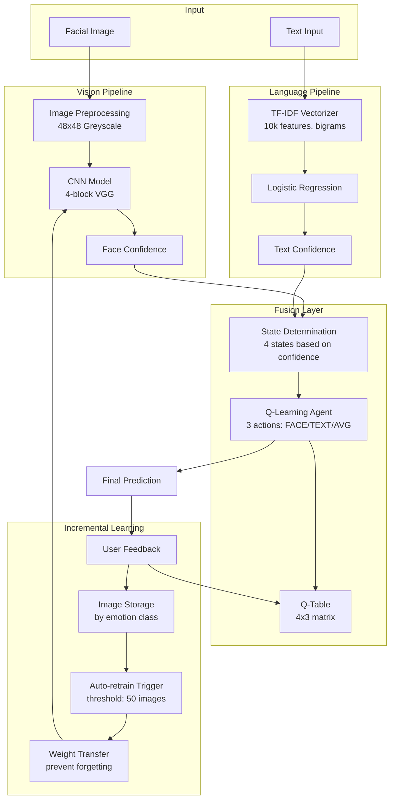

# Design Document: Adaptive Multimodal Emotion Detection System

## Overview

The Adaptive Multimodal Emotion Detection System is a machine learning platform that combines computer vision and natural language processing to detect human emotions. The system uses a reinforcement learning agent to intelligently fuse predictions from both modalities, learning over time which input source to trust based on confidence signals. The system implements incremental learning to grow its knowledge at runtime, automatically retraining when sufficient new examples accumulate.

The architecture follows a modular pipeline design:
1. **Vision Pipeline**: Processes facial images through a CNN to extract emotion probabilities
2. **Language Pipeline**: Processes text through TF-IDF vectorization and logistic regression
3. **Fusion Layer**: Q-learning agent that selects the best modality or averages predictions
4. **Incremental Learning Layer**: Manages feedback storage and triggers automatic retraining
5. **Interface Layer**: Flask web application with REST API and web UI

## Architecture

### High-Level Architecture



### System States

The Q-learning agent operates in 4 discrete states based on confidence thresholds:

1. **State 0**: Both face and text confidence are high (≥ 0.7)
2. **State 1**: Face confidence high (≥ 0.7), text confidence low (< 0.7)
3. **State 2**: Face confidence low (< 0.7), text confidence high (≥ 0.7)
4. **State 3**: Both face and text confidence are low (< 0.7)

### Actions

The Q-learning agent can take 3 actions:

1. **Action 0 (FACE)**: Use facial emotion prediction
2. **Action 1 (TEXT)**: Use text emotion prediction
3. **Action 2 (AVERAGE)**: Average both predictions

## Components and Interfaces


### 1. Configuration Module (`config/config.py`)

Centralizes all system parameters, paths, and constants.

```python
class Config:
    # Emotion classes
    EMOTIONS = ['angry', 'disgust', 'fear', 'happy', 'neutral', 'sad', 'surprise']
    NUM_EMOTIONS = len(EMOTIONS)
    
    # CNN parameters
    IMG_SIZE = (48, 48)
    CNN_BLOCKS = 4
    CNN_FILTERS = [64, 128, 256, 512]
    CNN_DROPOUT = 0.5
    CNN_LEARNING_RATE = 0.0001
    CNN_BATCH_SIZE = 32
    CNN_EPOCHS = 50
    
    # NLP parameters
    TFIDF_MAX_FEATURES = 10000
    TFIDF_NGRAM_RANGE = (1, 2)
    LR_MAX_ITER = 1000
    LR_RANDOM_STATE = 42
    
    # Q-learning parameters
    Q_LEARNING_RATE = 0.1
    Q_DISCOUNT_FACTOR = 0.9
    Q_EPSILON = 0.1  # exploration rate
    CONFIDENCE_THRESHOLD_HIGH = 0.7
    NUM_STATES = 4
    NUM_ACTIONS = 3
    
    # Incremental learning parameters
    RETRAIN_THRESHOLD = 50  # images per emotion class
    TRANSFER_LEARNING_RATE = 0.00001
    
    # Paths
    BASE_DIR = 'emotion_detection_system'
    DATA_DIR = f'{BASE_DIR}/data'
    MODELS_DIR = f'{BASE_DIR}/models'
    LOGS_DIR = f'{BASE_DIR}/logs'
    INCREMENTAL_DIR = f'{DATA_DIR}/incremental'
    
    # Model file paths
    CNN_MODEL_PATH = f'{MODELS_DIR}/cnn_model.h5'
    TFIDF_VECTORIZER_PATH = f'{MODELS_DIR}/tfidf_vectorizer.pkl'
    LR_MODEL_PATH = f'{MODELS_DIR}/lr_model.pkl'
    Q_TABLE_PATH = f'{MODELS_DIR}/q_table.npy'
    
    # Logging
    LOG_FILE = f'{LOGS_DIR}/system.log'
    LOG_MAX_BYTES = 10 * 1024 * 1024  # 10 MB
    LOG_BACKUP_COUNT = 5
```

### 2. Logger Module (`utils/logger.py`)

Provides rotating file and console logging with configurable verbosity.

```python
class SystemLogger:
    def __init__(self, log_file: str, max_bytes: int, backup_count: int):
        """Initialize logger with rotating file handler and console handler"""
        pass
    
    def log_prediction(self, modality: str, input_data: dict, 
                      prediction: str, confidence: float):
        """Log prediction with timestamp and details"""
        pass
    
    def log_q_update(self, state: int, action: int, reward: float, 
                     old_q: float, new_q: float):
        """Log Q-table update"""
        pass
    
    def log_retrain(self, trigger_reason: str, samples_count: dict, 
                   metrics: dict):
        """Log retraining event with performance metrics"""
        pass
    
    def info(self, message: str):
        """Log info level message"""
        pass
    
    def warning(self, message: str):
        """Log warning level message"""
        pass
    
    def error(self, message: str, exc_info: bool = False):
        """Log error level message with optional exception info"""
        pass
```

### 3. Data Generator Module (`utils/data_generator.py`)

Generates synthetic training data for bootstrapping the system.

```python
class SyntheticDataGenerator:
    def __init__(self, emotions: list, img_size: tuple):
        """Initialize generator with emotion classes and image dimensions"""
        pass
    
    def generate_face_images(self, samples_per_emotion: int, 
                            output_dir: str) -> dict:
        """Generate synthetic facial images with emotion-specific patterns
        
        Returns: Dictionary mapping emotion to list of image paths
        """
        pass
    
    def generate_text_samples(self, samples_per_emotion: int) -> dict:
        """Generate synthetic text samples with emotion-specific keywords
        
        Returns: Dictionary mapping emotion to list of text strings
        """
        pass
    
    def load_real_dataset(self, dataset_name: str, 
                         dataset_path: str) -> tuple:
        """Load real datasets (FER-2013, ISEAR, GoEmotions)
        
        Returns: (images, labels) or (texts, labels)
        """
        pass
```

### 4. Face Model Module (`models/face_model.py`)

Implements CNN for facial emotion recognition.

```python
class FaceEmotionModel:
    def __init__(self, config: Config):
        """Initialize with configuration"""
        self.config = config
        self.model = None
    
    def build_model(self) -> tf.keras.Model:
        """Build 4-block VGG-inspired CNN with Global Average Pooling
        
        Architecture:
        - Input: 48x48x1 greyscale image
        - Block 1: Conv(64) -> Conv(64) -> MaxPool -> Dropout
        - Block 2: Conv(128) -> Conv(128) -> MaxPool -> Dropout
        - Block 3: Conv(256) -> Conv(256) -> MaxPool -> Dropout
        - Block 4: Conv(512) -> Conv(512) -> GlobalAvgPool -> Dropout
        - Dense(NUM_EMOTIONS) -> Softmax
        """
        pass
    
    def preprocess_image(self, image_path: str) -> np.ndarray:
        """Load and preprocess image to 48x48 greyscale"""
        pass
    
    def train(self, X_train: np.ndarray, y_train: np.ndarray,
             X_val: np.ndarray, y_val: np.ndarray) -> dict:
        """Train CNN model
        
        Returns: Training history with loss and accuracy metrics
        """
        pass
    
    def predict(self, image_path: str) -> tuple:
        """Predict emotion from image
        
        Returns: (emotion_label, probabilities, confidence_score)
        """
        pass
    
    def save_model(self, path: str):
        """Save model weights to disk"""
        pass
    
    def load_model(self, path: str):
        """Load model weights from disk"""
        pass
    
    def transfer_weights(self, new_model: tf.keras.Model):
        """Transfer weights to new model for incremental learning"""
        pass
```

### 5. Text Model Module (`models/text_model.py`)

Implements TF-IDF + Logistic Regression for text emotion recognition.

```python
class TextEmotionModel:
    def __init__(self, config: Config):
        """Initialize with configuration"""
        self.config = config
        self.vectorizer = None
        self.classifier = None
    
    def build_vectorizer(self) -> TfidfVectorizer:
        """Build TF-IDF vectorizer with max 10k features and bigrams"""
        pass
    
    def build_classifier(self) -> LogisticRegression:
        """Build Logistic Regression classifier with warm_start"""
        pass
    
    def train(self, texts: list, labels: list) -> dict:
        """Train TF-IDF + LR model
        
        Returns: Training metrics (accuracy, precision, recall, f1)
        """
        pass
    
    def predict(self, text: str) -> tuple:
        """Predict emotion from text
        
        Returns: (emotion_label, probabilities, confidence_score)
        """
        pass
    
    def save_model(self, vectorizer_path: str, classifier_path: str):
        """Save vectorizer and classifier using joblib"""
        pass
    
    def load_model(self, vectorizer_path: str, classifier_path: str):
        """Load vectorizer and classifier using joblib"""
        pass
    
    def incremental_train(self, texts: list, labels: list):
        """Incrementally train classifier using warm_start"""
        pass
```

### 6. RL Fusion Module (`models/rl_fusion.py`)

Implements Q-learning agent for modality fusion.

```python
class RLFusionAgent:
    def __init__(self, config: Config):
        """Initialize Q-learning agent"""
        self.config = config
        self.q_table = np.zeros((config.NUM_STATES, config.NUM_ACTIONS))
    
    def determine_state(self, face_confidence: float, 
                       text_confidence: float) -> int:
        """Determine state based on confidence thresholds
        
        State 0: Both high (≥0.7)
        State 1: Face high, text low
        State 2: Face low, text high
        State 3: Both low
        """
        pass
    
    def select_action(self, state: int, epsilon: float = None) -> int:
        """Select action using epsilon-greedy policy
        
        Returns: 0 (FACE), 1 (TEXT), or 2 (AVERAGE)
        """
        pass
    
    def fuse_predictions(self, face_probs: np.ndarray, text_probs: np.ndarray,
                        action: int) -> tuple:
        """Fuse predictions based on selected action
        
        Returns: (final_emotion, final_probabilities, fusion_method)
        """
        pass
    
    def update_q_table(self, state: int, action: int, reward: float,
                      next_state: int):
        """Update Q-table using Q-learning algorithm
        
        Q(s,a) = Q(s,a) + α[r + γ*max(Q(s',a')) - Q(s,a)]
        """
        pass
    
    def compute_reward(self, predicted_emotion: str, 
                      true_emotion: str) -> float:
        """Compute reward based on prediction correctness
        
        Returns: 1.0 if correct, -1.0 if incorrect
        """
        pass
    
    def get_q_table_display(self) -> str:
        """Return human-readable Q-table representation"""
        pass
    
    def save_q_table(self, path: str):
        """Save Q-table to disk"""
        pass
    
    def load_q_table(self, path: str):
        """Load Q-table from disk"""
        pass
```

### 7. Incremental Learning Module (`models/incremental_learning.py`)

Manages feedback storage and automatic retraining.

```python
class IncrementalLearner:
    def __init__(self, config: Config, face_model: FaceEmotionModel,
                 logger: SystemLogger):
        """Initialize incremental learner"""
        self.config = config
        self.face_model = face_model
        self.logger = logger
        self.storage_stats = {emotion: 0 for emotion in config.EMOTIONS}
    
    def store_feedback(self, image_path: str, emotion: str):
        """Store image in emotion-specific folder for incremental learning"""
        pass
    
    def check_retrain_trigger(self) -> bool:
        """Check if any emotion class has reached retrain threshold
        
        Returns: True if retraining should be triggered
        """
        pass
    
    def auto_retrain(self):
        """Automatically retrain CNN with accumulated samples
        
        Process:
        1. Load all stored images
        2. Create new model with same architecture
        3. Transfer weights from old model
        4. Train with lower learning rate
        5. Update face_model with new weights
        """
        pass
    
    def get_statistics(self) -> dict:
        """Get current storage statistics
        
        Returns: Dictionary with samples per emotion class
        """
        pass
    
    def reset_statistics(self):
        """Reset storage statistics after retraining"""
        pass
```

### 8. Flask Application Module (`app.py`)

Provides Flask web interface with REST API endpoints and web UI.

```python
from flask import Flask, request, jsonify, render_template, send_from_directory
from werkzeug.utils import secure_filename
import os

app = Flask(__name__)
app.config['UPLOAD_FOLDER'] = 'uploads'
app.config['MAX_CONTENT_LENGTH'] = 16 * 1024 * 1024  # 16MB max file size

class EmotionDetectionAPI:
    def __init__(self):
        """Initialize all system components"""
        self.config = Config()
        self.logger = SystemLogger(...)
        self.face_model = FaceEmotionModel(self.config)
        self.text_model = TextEmotionModel(self.config)
        self.fusion_agent = RLFusionAgent(self.config)
        self.incremental_learner = IncrementalLearner(...)
        self.session_stats = {
            'predictions': 0,
            'face_only': 0,
            'text_only': 0,
            'fusion': 0,
            'correct': 0
        }
    
    def initialize_system(self):
        """Load or train all models"""
        pass

# Global system instance
emotion_system = EmotionDetectionAPI()

@app.route('/')
def index():
    """Render main web interface"""
    return render_template('index.html')

@app.route('/api/predict/multimodal', methods=['POST'])
def predict_multimodal():
    """Predict emotion using both face and text
    
    Request:
        - image: file upload
        - text: string
    
    Response:
        {
            "emotion": "happy",
            "confidence": 0.85,
            "probabilities": {...},
            "modality": "fusion",
            "fusion_method": "AVERAGE"
        }
    """
    pass

@app.route('/api/predict/face', methods=['POST'])
def predict_face():
    """Predict emotion from facial image only
    
    Request:
        - image: file upload
    
    Response:
        {
            "emotion": "sad",
            "confidence": 0.72,
            "probabilities": {...},
            "modality": "face"
        }
    """
    pass

@app.route('/api/predict/text', methods=['POST'])
def predict_text():
    """Predict emotion from text only
    
    Request:
        - text: string
    
    Response:
        {
            "emotion": "angry",
            "confidence": 0.68,
            "probabilities": {...},
            "modality": "text"
        }
    """
    pass

@app.route('/api/feedback', methods=['POST'])
def submit_feedback():
    """Submit user feedback for incremental learning
    
    Request:
        {
            "prediction_id": "uuid",
            "correct_emotion": "happy",
            "image_path": "path/to/image"
        }
    
    Response:
        {
            "success": true,
            "message": "Feedback stored",
            "retrain_triggered": false
        }
    """
    pass

@app.route('/api/retrain', methods=['POST'])
def manual_retrain():
    """Manually trigger model retraining
    
    Response:
        {
            "success": true,
            "message": "Retraining completed",
            "metrics": {...}
        }
    """
    pass

@app.route('/api/qtable', methods=['GET'])
def get_qtable():
    """Get current Q-table state
    
    Response:
        {
            "qtable": [[...], [...], [...], [...]],
            "states": ["Both High", "Face High", "Text High", "Both Low"],
            "actions": ["FACE", "TEXT", "AVERAGE"]
        }
    """
    pass

@app.route('/api/statistics', methods=['GET'])
def get_statistics():
    """Get dataset and session statistics
    
    Response:
        {
            "dataset": {
                "angry": 120,
                "happy": 115,
                ...
            },
            "session": {
                "predictions": 45,
                "face_only": 12,
                "text_only": 8,
                "fusion": 25,
                "accuracy": 0.82
            }
        }
    """
    pass

@app.route('/api/health', methods=['GET'])
def health_check():
    """Health check endpoint
    
    Response:
        {
            "status": "healthy",
            "models_loaded": true,
            "version": "1.0.0"
        }
    """
    pass

if __name__ == '__main__':
    emotion_system.initialize_system()
    app.run(debug=True, host='0.0.0.0', port=5000)
```

### 9. Web UI Templates

**templates/index.html** - Main web interface with:
- File upload for facial images
- Text input area
- Prediction mode selector (multimodal/face-only/text-only)
- Real-time prediction results display
- Feedback submission form
- Q-table visualization
- Statistics dashboard
- Manual retrain button

**templates/components/**:
- `prediction_card.html` - Display prediction results
- `qtable_viz.html` - Q-table heatmap visualization
- `stats_dashboard.html` - Charts and statistics
- `feedback_form.html` - User feedback interface

**static/css/style.css** - Styling for web interface

**static/js/app.js** - Frontend JavaScript for:
- AJAX API calls
- File upload handling
- Real-time updates
- Chart rendering (using Chart.js)
- Form validation

## Data Models

### Emotion Prediction Result

```python
@dataclass
class PredictionResult:
    emotion: str                    # Predicted emotion label
    probabilities: np.ndarray       # Probability distribution over all emotions
    confidence: float               # Maximum probability (0.0 to 1.0)
    modality: str                   # 'face', 'text', or 'fusion'
    fusion_method: Optional[str]    # 'FACE', 'TEXT', 'AVERAGE', or None
    timestamp: datetime             # Prediction timestamp
```

### Q-Learning State

```python
@dataclass
class QLearningState:
    state_id: int                   # 0-3
    face_confidence: float          # Face model confidence
    text_confidence: float          # Text model confidence
    selected_action: int            # 0 (FACE), 1 (TEXT), 2 (AVERAGE)
    q_values: np.ndarray           # Q-values for all actions in this state
```

### Training Metrics

```python
@dataclass
class TrainingMetrics:
    accuracy: float
    loss: float
    val_accuracy: Optional[float]
    val_loss: Optional[float]
    precision: Optional[float]
    recall: Optional[float]
    f1_score: Optional[float]
    training_time: float            # seconds
    samples_count: int
```

### Incremental Learning Statistics

```python
@dataclass
class IncrementalStats:
    samples_per_emotion: dict       # {emotion: count}
    total_samples: int
    last_retrain_timestamp: Optional[datetime]
    retrain_count: int
    pending_retrain: bool
```


## Correctness Properties

*A property is a characteristic or behavior that should hold true across all valid executions of a system—essentially, a formal statement about what the system should do. Properties serve as the bridge between human-readable specifications and machine-verifiable correctness guarantees.*

### Property 1: Image Preprocessing Consistency

*For any* input image in standard formats (JPEG, PNG, BMP), preprocessing should produce a 48×48 greyscale numpy array with shape (48, 48, 1) and values normalized to [0, 1].

**Validates: Requirements 1.1, 1.5**

### Property 2: Model Output Structure

*For any* preprocessed image or vectorized text input, the respective model (CNN or NLP) should output a probability distribution that sums to 1.0 (within floating-point tolerance) and has length equal to the number of emotion classes.

**Validates: Requirements 1.2, 2.2**

### Property 3: Confidence Score Correctness

*For any* model prediction with probability distribution P, the confidence score should equal max(P).

**Validates: Requirements 1.3, 2.3**

### Property 4: State Determination Consistency

*For any* pair of confidence scores (face_conf, text_conf), the fusion agent should determine the state as:
- State 0 if both ≥ 0.7
- State 1 if face_conf ≥ 0.7 and text_conf < 0.7
- State 2 if face_conf < 0.7 and text_conf ≥ 0.7
- State 3 if both < 0.7

**Validates: Requirements 3.1**

### Property 5: Action Execution Correctness

*For any* pair of prediction probability distributions (face_probs, text_probs) and action selection:
- Action 0 (FACE) should return face_probs as final prediction
- Action 1 (TEXT) should return text_probs as final prediction
- Action 2 (AVERAGE) should return element-wise average of face_probs and text_probs

**Validates: Requirements 3.3**

### Property 6: Q-Learning Update Formula

*For any* Q-table update with state s, action a, reward r, and next state s', the new Q-value should equal:
Q(s,a) + α[r + γ*max(Q(s',·)) - Q(s,a)]
where α is learning rate and γ is discount factor.

**Validates: Requirements 3.4**

### Property 7: Incremental Storage and Statistics

*For any* feedback with image and emotion label, storing the feedback should:
1. Save the image to the correct emotion folder
2. Increment the statistics counter for that emotion by 1

**Validates: Requirements 4.1, 4.5**

### Property 8: Auto-Retrain Trigger

*For any* emotion class, when the stored sample count reaches the retrain threshold (50), the incremental learner should trigger automatic retraining.

**Validates: Requirements 4.2**

### Property 9: Weight Transfer Preservation

*For any* CNN model undergoing incremental retraining, the new model should initialize with weights from the old model before training on new data.

**Validates: Requirements 4.3**

### Property 10: Model Update After Retrain

*For any* completed retraining operation, the system's active CNN model reference should be updated to use the newly trained model.

**Validates: Requirements 4.4**

### Property 11: Fusion Selection Based on Q-Table

*For any* state and Q-table, when using greedy action selection (epsilon=0), the fusion agent should select the action with the highest Q-value for that state.

**Validates: Requirements 5.2**

### Property 12: Single Modality Handling

*For any* prediction request with only one modality (face or text), the system should return that modality's prediction directly without invoking the fusion agent.

**Validates: Requirements 5.3**

### Property 13: Prediction Result Completeness

*For any* prediction operation, the result should include: emotion label, probability distribution, confidence score, modality indicator, and fusion method (if applicable).

**Validates: Requirements 5.4, 5.5**

### Property 14: Balanced Synthetic Data Generation

*For any* synthetic data generation request with N samples per emotion, the generator should create exactly N samples for each emotion class, resulting in a balanced dataset.

**Validates: Requirements 7.1, 7.2, 7.3**

### Property 15: Model Persistence Round-Trip

*For any* trained model (CNN, NLP, or Q-table), saving then loading should preserve the model's predictions - i.e., predictions on the same input before and after save/load should be identical.

**Validates: Requirements 8.1, 8.2, 8.3, 8.4**

### Property 16: Model Initialization Fallback

*For any* system startup, if model files do not exist, the system should successfully train new models from scratch and be ready for predictions.

**Validates: Requirements 8.5**

### Property 17: Log Entry Completeness

*For any* system operation (prediction, Q-update, or retrain), the corresponding log entry should contain all required fields:
- Predictions: timestamp, modality, input metadata, prediction, confidence
- Q-updates: state, action, reward, old Q-value, new Q-value
- Retrains: trigger reason, sample counts, performance metrics

**Validates: Requirements 9.1, 9.2, 9.3**

### Property 18: Error Handling Graceful Degradation

*For any* invalid input (non-existent image path, corrupted image, empty text), the system should:
1. Return an error result (not crash)
2. Log the error with details
3. Continue accepting new requests

**Validates: Requirements 12.1, 12.2, 12.6**

### Property 19: Model Corruption Recovery

*For any* corrupted model file detected during loading, the system should fall back to training a new model from scratch and successfully complete initialization.

**Validates: Requirements 12.4**


## Error Handling

### Error Categories

1. **Input Validation Errors**
   - Invalid image paths → Return error message with path details
   - Corrupted image files → Log error, skip sample, continue processing
   - Empty or whitespace-only text → Return error message
   - Unsupported image formats → Return error with supported formats list

2. **Model Errors**
   - Model file not found → Train new model from scratch
   - Corrupted model file → Detect corruption, log warning, retrain
   - Prediction failure → Log exception with stack trace, return safe default
   - Training failure → Log error, preserve old model if available

3. **Resource Errors**
   - Insufficient disk space → Log warning, attempt to continue
   - Memory overflow during batch processing → Reduce batch size, retry
   - File permission errors → Log error with path and permissions

4. **Q-Learning Errors**
   - Invalid state/action → Log error, use default action (AVERAGE)
   - Q-table corruption → Reinitialize Q-table to zeros
   - Reward computation failure → Use neutral reward (0.0)

### Error Recovery Strategies

1. **Graceful Degradation**: System continues operating with reduced functionality
2. **Automatic Retry**: Retry operations with adjusted parameters (e.g., smaller batch size)
3. **Fallback to Defaults**: Use safe default values when computation fails
4. **State Preservation**: Save system state before risky operations
5. **Comprehensive Logging**: Log all errors with context for debugging

### Error Response Format

```python
@dataclass
class ErrorResult:
    success: bool = False
    error_type: str              # 'input_validation', 'model_error', 'resource_error'
    error_message: str           # Human-readable error description
    error_details: dict          # Additional context (path, exception type, etc.)
    timestamp: datetime
    recoverable: bool            # Whether operation can be retried
```

## Testing Strategy

### Overview

The testing strategy employs a dual approach combining unit tests for specific examples and edge cases with property-based tests for universal correctness guarantees. This comprehensive coverage ensures both concrete functionality and general correctness across all possible inputs.

### Property-Based Testing

Property-based testing validates universal properties across many generated inputs. We will use **Hypothesis** (Python's leading property-based testing library) to implement all correctness properties defined above.

**Configuration**:
- Minimum 100 iterations per property test
- Each test tagged with: `# Feature: emotion-detection-system, Property N: [property text]`
- Custom generators for domain-specific types (images, emotion labels, confidence scores)

**Property Test Examples**:

```python
from hypothesis import given, strategies as st
import hypothesis.extra.numpy as npst

# Property 1: Image Preprocessing Consistency
@given(image_format=st.sampled_from(['JPEG', 'PNG', 'BMP']))
def test_preprocessing_consistency(image_format):
    """Feature: emotion-detection-system, Property 1: Image preprocessing consistency"""
    # Generate synthetic image in specified format
    # Preprocess image
    # Assert output shape is (48, 48, 1)
    # Assert values in [0, 1]
    pass

# Property 3: Confidence Score Correctness
@given(probs=npst.arrays(dtype=np.float32, shape=(7,), 
                         elements=st.floats(0, 1)).filter(lambda x: x.sum() > 0))
def test_confidence_equals_max_probability(probs):
    """Feature: emotion-detection-system, Property 3: Confidence score correctness"""
    probs = probs / probs.sum()  # Normalize to probability distribution
    confidence = compute_confidence(probs)
    assert abs(confidence - np.max(probs)) < 1e-6

# Property 6: Q-Learning Update Formula
@given(state=st.integers(0, 3), action=st.integers(0, 2),
       reward=st.floats(-1, 1), next_state=st.integers(0, 3))
def test_q_learning_update_formula(state, action, reward, next_state):
    """Feature: emotion-detection-system, Property 6: Q-learning update formula"""
    agent = RLFusionAgent(config)
    old_q = agent.q_table[state, action]
    agent.update_q_table(state, action, reward, next_state)
    new_q = agent.q_table[state, action]
    
    expected_q = old_q + config.Q_LEARNING_RATE * (
        reward + config.Q_DISCOUNT_FACTOR * np.max(agent.q_table[next_state]) - old_q
    )
    assert abs(new_q - expected_q) < 1e-6
```

### Unit Testing

Unit tests validate specific examples, edge cases, and integration points. Focus areas:

1. **Component Initialization**
   - Test each component initializes with correct default values
   - Test configuration loading and validation
   - Test directory structure creation

2. **Edge Cases**
   - Empty text input handling
   - Single-pixel images
   - All-zero probability distributions
   - Q-table with all equal values
   - Exactly 50 images triggering retrain

3. **Integration Points**
   - End-to-end prediction flow (image + text → fusion → result)
   - Feedback loop (prediction → feedback → Q-update → storage)
   - Retrain workflow (trigger → weight transfer → train → update)

4. **Model Architecture**
   - CNN has correct number of layers and parameters
   - TF-IDF vectorizer configured with correct parameters
   - Q-table has correct dimensions (4×3)

5. **Error Conditions**
   - Invalid file paths
   - Corrupted model files
   - Disk space errors (mocked)
   - Network errors for dataset downloads (mocked)

### Test Organization

```
tests/
├── test_face_model.py          # CNN model tests
├── test_text_model.py          # NLP model tests
├── test_rl_fusion.py           # Q-learning agent tests
├── test_incremental_learning.py # Incremental learner tests
├── test_data_generator.py      # Data generation tests
├── test_preprocessing.py       # Image/text preprocessing tests
├── test_integration.py         # End-to-end workflow tests
├── test_error_handling.py      # Error scenarios tests
├── test_persistence.py         # Save/load tests
└── conftest.py                 # Shared fixtures and generators
```

### Test Coverage Goals

- Overall code coverage: ≥ 80%
- Core logic coverage (models, fusion, incremental): ≥ 90%
- Error handling paths: ≥ 70%
- UI/menu code: ≥ 60% (lower priority)

### Continuous Testing

- Run unit tests on every code change
- Run property tests before commits
- Run full test suite (including integration tests) before releases
- Monitor test execution time (target: < 2 minutes for full suite)

### Test Data Management

- Use synthetic data generators for most tests (fast, reproducible)
- Include small real dataset samples for integration tests
- Mock external dependencies (file I/O, network) where appropriate
- Use fixtures for common test objects (models, configs, sample data)
